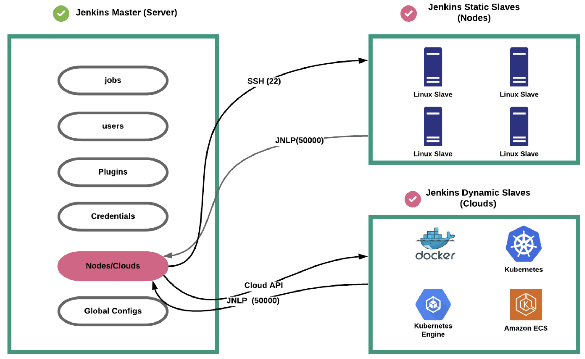
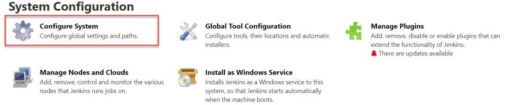

# JENKINS ARCHITECTURE

## JENKINS MASTER

Jenkins Master is the central component in a Jenkins architecture. It holds all key configurations and it's responsible for orchestrates all the workflow defined in the pipelines. The Jenkins Master serves as the primary interface for users to configure and run their builds.
It's also called as **Controller**.

### Jenkins Jobs

A Jenkins job is a user-configured description of work which Jenkins should perform.

Jobs can contain pipelines but they can also contain other workflows. For Jenkins, **the terms of "job" and "project" are the same**. Even the project term is already deprecated.

> [!WARNING]
> **Don't misunderstand "Job" with "Pipeline"**, they're quite different. 
**Pipelines** are Jenkins jobs enabled by the Pipeline (formerly called “workflow”) plugin and built with simple text scripts that use a Pipeline DSL (domain-specific language) based on the Groovy programming language. 
`Jenkins Pipeline = Pipeline = Pipeline Job type`: is a suite of plugins which supports implementing and integrating continuous delivery pipelines into Jenkins.

### Users

Jenkins has te following type of primary authentication methods:

- **Jenkins's own user database**
    - Set of users maintained by Jenkins's own database. In this context database = flat config files (XML files)
- **LDAP Integration**
    - Jenkins authentication using corporate LDAP configuration
    - LDAP? It's an open-source extension of Active Directory
- **SAML Single Sign On (SSO)**
    - Supports single signon using providers like Okta, AzureAD, Auth0, etc.

### Jenkins Plugins

[Plugins](https://plugins.jenkins.io/) are community-developed modules that we can install on our Jenkins server. It helps us with more functionalities that are not natively available in Jenkins.

We can also download the plugin file and install it by copying it to the plugins directory under `/var/lib/jenkins` folder. 

### Jenkins Credentials

When we set up Jenkins Pipelines, there are scenarios where it needs to connect to a cloud account, a server, a database, or an API using **secrets**.

In Jenkins, we can save different types of secrets as a credentials:

- Secret Text
- Username and Password
- SSH Keys

> [!NOTE]
> All credentials are encrypted by Jenkins. The secrets are stored in `$JENKINS_HOME/secrets/` directory. It's very important to secure this directory and exclude it from Jenkins backups.

> [!TIP]
> Best Practice is to use external secrets managements solutions like vault/AWS Secrets/Azure Key Vault instead of Jenkins native credentials

### Jenkins Node/Clouds

We can configure multiples agents as:

- Static Agents (Static Slaves) = **Nodes**
    - On-premise servers
- Dynamic Agents (Dynamic Slave) = **Cloud**
    - Cloud Services such as: Docker, Kubernetes, AWS ECS, Azure Container Apps

### Jenkins Global Settings (System Configuration)

Under Jenkins Global configuration, you have all the configurations of installed plugins and native Jenkins global configurations.

## Jenkins Agent

Jenkins Agents are the "worker" nodes that actually execute all the steps mentioned in a Job. 

When we create a Jenkins Job, we have to assign an agent(has an unique identifier label) to it.

> [!TIP]
> We can run jobs in the Jenkins Master without a Jenkins Agent configuration. Hence, the Master node acts as the agent.
However, a good practice is to have a Jenkins Controller-Agent setup.

## Jenkins Controller-Agent Connectivity

There are two ways Jenkins controller and agent can communicate:

- **Using the SSH method:** Uses the ssh protocol to connect to the agent. 
    - The connections gets initiated from the Jenkins Controller.
- **Using the JNLP method**: Uses java JNLP protocol (Java Network Launch Protocol).
    - A Java Agent gets initiated from the Agent with Jenkins Controller.
    - The master node FireWall should allow the JNLP connectivity

There are two types of Jenkins Agents:

- **Agent Nodes:** These are servers (Windows/Linux/MacOs) that will be configured as *statict agents*.
- **Agent CLouds:** Jenkins Cloud Agent is a concept of having dynamic agents. Whenever we trigger a job, an agent gets deployed as a VM/Container *on demand* and gets deleted once the job is completed.

Here's an example of Agent deployments :

## Jenkins Data

Jenkins stores its global configuration in files on the Jenkins controller. Administrators and privileged users modify the global configuration from the Jenkins configuration pages.

### Jenkins home directory

The `JENKINS_HOME` directory is the root of the directory structure on disk that Jenkins uses to perform builds and keep archives. The Jenkins home directory is listed in `Manage Jenkins > System` under the Home directory heading.

By default, the `JENKINS_HOME` points to: `/var/lib/jenkins/`

> [!TIP]
> It's essential to **Backup the Jenkins data** folder every time for Disaster recovery (DS)

[***Next***](../chapter-two/README.md)
