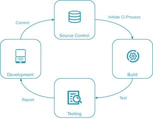
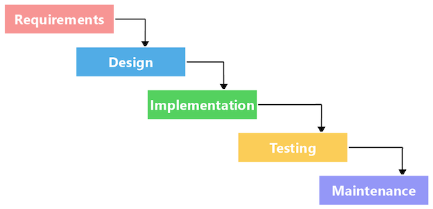

# Chapter 0: fundamental concepts

## Introduction

Jenkins is the **#1 Continuous Integration and Delivery server**, develop by *Kohsuke Kawaguchi*, one of the founders of CloudBees, created it in 2006 as the "Hudson" project. In 2011, the project was renamed to Jenkins.

Jenkins is maintained and supported by an independent and active community (https://www.jenkins.io) that welcomes new contributors of all technical and experience levels.

## Continuous Workflow

Continuous workflow concept means to **have the code in a valid and stable state at all times.**

Here's a Workflow example:

### Traditional development: Waterfall methodology

The waterfall methodology is a sequential and linear approach to software development with distinct phases:

1. Requirements: Define and document project requirements.
1. Design: Plan the software architecture and components.
1. Implementation: Code based on the design specifications.
1. Testing: Verify the software for defects and adherence to requirements.
1. Deployment: Release the software to production or users.
1. Maintenance: Provide ongoing support, updates, and bug fixes.

Each phase requires a deliverable from the previous phase to proceed.

### Modern development methodologies

The modern development methodologies emphasize collaboration between different teams, flexibility in planning and development, and shorter development cycles. Three most common is:

- **Agile** - emphasizes adaptive planning and evolutionary development. Work is planned and completed in "sprints" (usually 1-2 weeks of work), with frequent (usually daily) "scrums" where all team members report progress and plan their next steps. See the Agile Manifesto.

### Continuous philosophy

Implements Agile method and DevOps mindset  with tools that standardize the steps in the process and thoroughly test each code modification before it is integrated into the official source.

In summary:

- Each integration is verified by an automated build (including tests).
- Automate the complete build-test-deploy cycle to ensure that activities always run in the same order.
- Build and test each code modification to find problems early, when they are easier to fix.

In a real-world, the Continuous philosophy is implemented by the following concepts:

- **Continuous Integration (CI)** is the frequent, *automatic integration of code*. All new and modified code is automatically tested with the master code.
- **Continuous Delivery (CD)** is the natural extension of CI. It ensures that the code is always ready to be deployed, although manual approval is required to actually deploy the software to production.
- **Continuous Deployment** automatically *deploys all validated changes to production*.

To successfully implement continuous delivery, it is essential to have a collaborative working relationship with everyone involved. You can then use Delivery **Pipelines**, which are automated implementations of your product’s lifecycle.

## Jenkins Workflow

Jenkins automatically **performs and orchestrate** all the activities required to deliver your software. You specify how to **build** and **test** your software as well as when, where, and how to **deploy** it using these guidelines:

- Define a Jenkins Pipeline to run each activity in the same order every time.
- Pipeline is glue for the activities defined. Do not code build actions directly in the Pipeline! Instead, use shell scripts or a tool such as Apache Maven, Gradle, npm, Apache Ant, or make to define the specific actions required at each step and use the pipeline to define the execution order.
- The pipeline runs each time the code is modified.

## Source Code Management (SCM)

Source code management systems (SCMs), also known as version control systems (VCSs), are software systems that record all changes for a set of files over time. This allows you to share those changes and provide merging and tracking history of the recorded changes.

### Advanced SCM

Advanced SCMs support the most powerful Jenkins capabilities, allowing a Pipeline run to be triggered by a code modification. Git technology supports this ability.

**Git** is the core technology used in many cloud-based SCM systems, including GitHub, Bitbucket, GitLab and so on.

## Software testing

Testing is a critical component of the *software development cycle*. Include a good set of tests as part of your pipeline so your team can:

- Validate that the software meets its goals.
- Search for defects that can be fixed to improve software quality.
- Facilitate refactoring and upgrades by validating that everything is still working after the changes are applied.

### Automated testing

**Testing should be automated** as much as possible, based on the following principles and practices:

- Tests can be run frequently and always in the same order.
- Running tests frequently means that problems are found early and you usually know which small piece of code caused the problem.
- Automated tests consume machine resources but require little human time beyond what is required to review the test results.
- Tests should be independent from each other as much as possible.
- Many tests can be run in parallel—​especially tests that validate your code for different operating systems or JDK versions.
- Define different tests to run at different stages of the build chain.

### Categories of testing

Test types can be categorized by how quickly they run. Faster automated test types include:

- **Unit tests** test a small piece of code (a function, method, or command). They run the fastest and are often written by the person who writes the code.
- **Integration tests** validate integration between multiple subsystems, including external subsystems such as a database.
- **Smoke tests** (also known as **sanity checking**) validate basic functions of the system.

Slower automated test types include:

- **Functional tests** validate the normal software behaviors against the expectations and requirements.
- **Non-regression tests** validate that the system still produces the same result.
- **Acceptance tests** test the full product from the perspective of the end user use cases and sentiment. These tests usually include manual testing.

> [!NOTE]
> Manual testing should be performed rarely, and only on software that has passed all automated tests. It is appropriate when the test result is subjective, such as user experience testing, and when the cost of automation is excessive.

### Learn more about software testing

Here are a few articles to get you started:

- The stackoverflow [What are unit tests, integration tests, smoke tests, and regression tests?](https://stackoverflow.com/questions/520064/what-is-unit-test-integration-test-smoke-test-regression-test) discussion introduces the types of testing you can perform.
- Martin Fowler writes extensively about software development, and proper testing figures prominently in his writing.  You may enjoy his articles about [Unit testing](https://martinfowler.com/bliki/UnitTest.html), [Test Coverage](https://martinfowler.com/bliki/TestCoverage.html), and [Test Driven Development](https://martinfowler.com/bliki/TestDrivenDevelopment.html).
